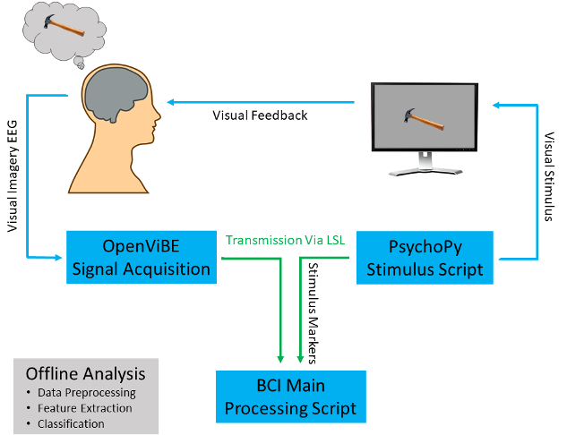

# Visual Imagery EEG BCI (Microsoft Research Internship Project)

This repository contains code and tutorials for investigating **visual imagery as a control paradigm for EEG-based brain-computer interfaces (BCIs)**.

The project is based on the following publication:

**Kilmarx, J.**, Gamper, H., Emmanouilidou, D., Johnston, D., Cutrell, E., Wilson, A., & Tashev, I. (2022, February). Investigating visual imagery as a BCI control strategy: A pilot study. In _2022 10th International Winter Conference on Brain-Computer Interface (BCI)_ (pp. 1-6). IEEE.

## Project Overview & Live Demo

This project includes a full end-to-end pipeline for **real-time EEG decoding and closed-loop BCI control**.

The video below shows:
- Overview of brain-computer interface applications and control strategies
- Experimental protocol description
- Preprocessing and feature extraction methods
- Results of offline and online classification of visual imagery
- Real-time BCI demo of closed-loop interaction

*Click the image above to watch the full real-time BCI system in action.*

Key findings:
- ~64% accuracy for face vs scene imagery (offline)
- ~60% cross-session generalization
- ~47% accuracy in real-time 3-class BCI (face / scene / rest)

These results demonstrate that visual imagery is a **feasible and intuitive BCI control paradigm**, with potential advantages in scalability and usability.

## Repository Contents

### Tutorial Notebook
`analysis_tutorial.ipynb`

Step-by-step walkthrough of:
- EEG preprocessing
- Feature extraction (power spectrum)
- Classification (SVM)
- Cross-validation

### Analysis Utilities
`analysis_functions.py`

Helper functions for:
- Filtering (bandpass + notch)
- Rereferencing
- Epoching EEG data
- Power spectral feature extraction
- Model training and evaluation

### Real-Time Pipeline
`main_realtime_nk.py`  
`processing_nk.py`

Example implementation of a **real-time EEG decoding system**, including:
- Streaming data processing
- Online feature extraction
- Real-time classification
- Feedback loop

## Methods Summary

### Data Acquisition
- 32-channel EEG (10–20 system)
- Sampling rate: 500 Hz
- Dry electrode system

### Preprocessing
- Rereferencing to mastoid channels
- Bandpass filtering:
  - 1–40 Hz (observation)
  - 1–125 Hz (imagery)
- Notch filtering at 60 Hz (and harmonic)
- z-score standardization
- Epoching into overlapping windows

### Features
- Power spectrum (1–100 Hz)

### Model
- Linear SVM
- Leave-one-run-out cross-validation

### Real-Time Inference
- Single-epoch classification from mid-trial window
- Closed-loop feedback

## System Architecture

The figure below shows the full end-to-end pipeline for real-time EEG decoding and closed-loop BCI interaction.

Key components:
- **EEG Acquisition (OpenViBE):** streams multi-channel EEG data
- **Stimulus Presentation (PsychoPy):** controls experimental paradigm and timing
- **LSL (Lab Streaming Layer):** synchronizes data and stimulus markers
- **Real-Time BCI Processing:** performs preprocessing, feature extraction, and classification
- **Closed-Loop Feedback:** model predictions are presented back to the user in real time

This architecture bridges offline modeling and real-time deployment, enabling interactive BCI control.

## Key Insight

Visual imagery performance depends strongly on **representational separability**:

- Faces vs scenes → strong separability → better decoding
- Objects (e.g., flower vs hammer) → higher similarity → worse decoding

## Follow-Up Work

A follow-up study was conducted to further investigate these limitations and evaluate the robustness of visual imagery as a BCI control paradigm:

**Kilmarx, J.**, Tashev, I., Millán, J. D. R., Sulzer, J., & Lewis-Peacock, J. (2024). Evaluating the feasibility of visual imagery for an EEG-based Brain–Computer interface. _IEEE Transactions on Neural Systems and Rehabilitation Engineering_, 32, 2209-2219.

This work expands on the pilot study by demonstrating:

- **Short-term visual imagery (working memory)** performed immediately after viewing an image produces stronger and more decodable neural signals than **long-term (spontaneous) imagery** retrieved from memory  

- Short-term imagery shares **overlapping neural representations with visual perception**, particularly in posterior (occipital) regions  

- In contrast, long-term visual imagery shows greater involvement of **frontal regions**, reflecting contributions from memory, attention, and cognitive control  

- Long-term imagery produces **weaker and more variable representations**, making it substantially more difficult to decode from EEG    

These findings highlight a key tradeoff: paradigms that are more realistic for real-world BCI use (spontaneous imagery) are also more challenging to decode, emphasizing the importance of task design and user strategy.
